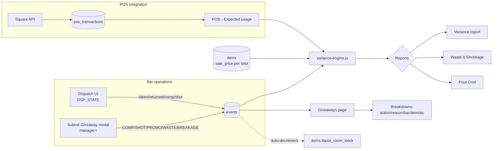
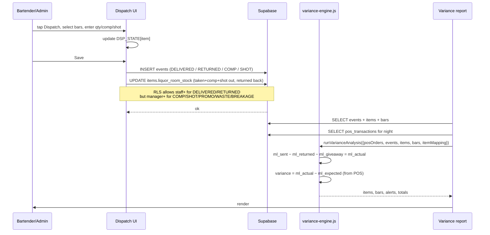
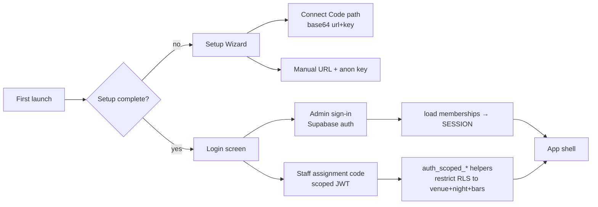
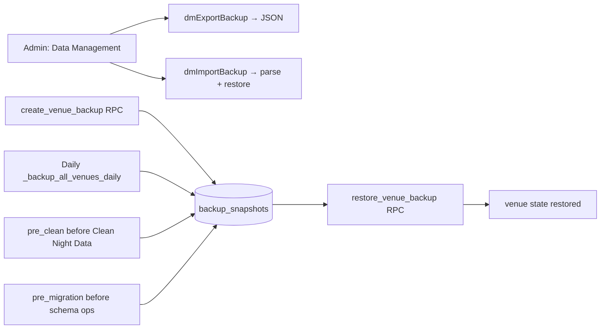
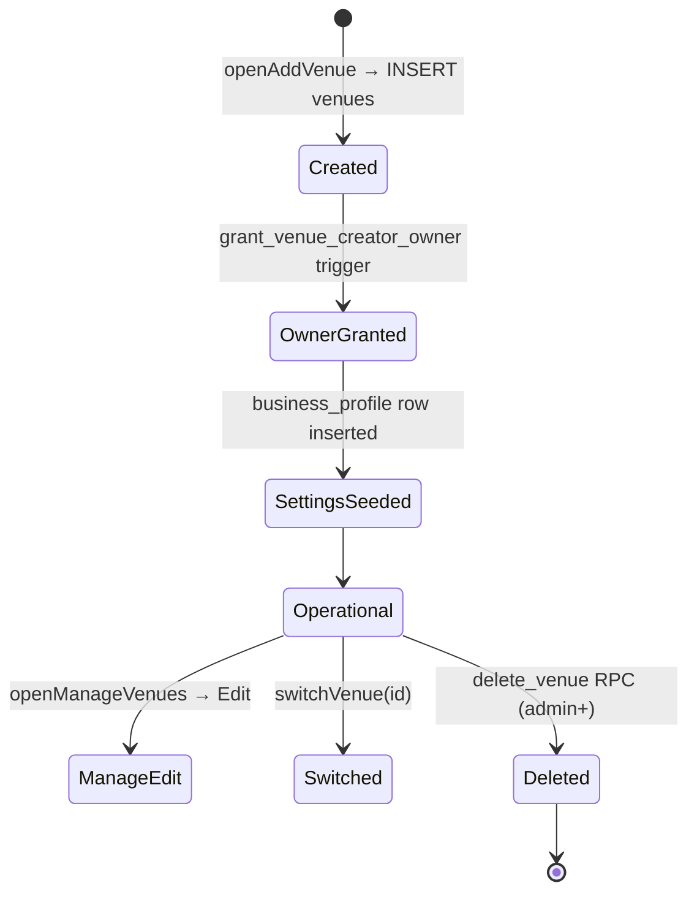

# BARINV Pro — Complete Project Specification

> Hand this document to a new AI chat (Claude / ChatGPT) and the project should be regenerable from scratch. It captures architecture, schema, RLS, RPCs, subsystem flows, build workflow, and known technical debt as of **v2.4.0 + Phase-1 Giveaways (v266–v268 service-worker cache)**.

---

## 1. What BARINV is

Professional inventory-management SaaS for bars, night clubs, restaurants, hotels, convention centres, and event venues. Tracks liquor from storeroom → bar → pour, reconciles against POS sales (Square), and flags unexplained loss.

- **Target devices:** iPhone / iPad (primary) via Capacitor-wrapped WKWebView; same HTML also runs in any browser / PWA.
- **Multi-tenant:** one Supabase database → N organisations → N venues per org → per-venue role-scoped users.
- **Offline-tolerant:** service worker caches static assets; data mutations require network but app shell loads offline.
- **Current data:** Live production project in Supabase region `ca-central-1`, project ref `uzommuafouvaerdvirzf`.

## 2. Tech stack

| Layer | Technology |
|---|---|
| Frontend shell | Single-file `www/index.html` (≈ 16 800 lines) — HTML + CSS + vanilla JS |
| Auxiliary JS | `www/variance-engine.js` (POS ↔ inventory math, ~770 lines, Node-testable) |
| Service worker | `www/sw.js` — network-first for HTML, cache-first for assets |
| Database / auth / storage | Supabase (Postgres 17 + PostgREST + GoTrue) |
| POS integration | Square Orders / Catalog APIs |
| Native wrapper | Capacitor 8 → iOS (`ios/App/App.xcodeproj`) |
| Plugins | `@capacitor/camera`, `barcode-scanner`, `bluetooth-le`, `filesystem`, `push-notifications`, `share`, `splash-screen`, `status-bar`, `preferences`, `app` |
| Build | `npm run build` (tsc + copy capacitor.js), `npx cap copy ios` after every `www/` change |

## 3. Repository layout

```
BARINV-PRO IOS/
├── README.md                      # (this file)
├── package.json                   # Capacitor + plugin deps
├── capacitor.config.json          # iOS + plugin config (appId: com.barinv.pro)
├── tsconfig.json                  # TS config (only consumed for plugin types)
├── .gitignore                     # node_modules, ios/App/Pods, backups/, .env
├── privacy-policy.html            # Standalone PP served at /privacy-policy.html
├── backups/                       # LOCAL DB dumps (gitignored — canonical is backup_snapshots table)
├── www/
│   ├── index.html                 # ENTIRE app UI + business logic
│   ├── variance-engine.js         # Pure-function POS ↔ inventory math (browser + Node)
│   ├── variance-engine-tests.js   # Node test harness — `node www/variance-engine-tests.js`
│   ├── sw.js                      # Service worker, cache version `barinv-vNNN`
│   ├── manifest.json              # PWA manifest
│   ├── capacitor.js               # Copied from @capacitor/core at build
│   ├── native/                    # iOS-specific overrides (compiled)
│   └── img/                       # App icons, placeholders
├── ios/                           # Capacitor-generated Xcode project
│   └── App/App/public/            # `npx cap copy` mirrors www/ here (gitignored)
└── src/                           # TS source (if any) — currently empty shell
```

**Rule:** All application UI + business logic lives in `www/index.html` except the variance engine (physically split so it can be unit-tested in Node). Do not introduce new JS modules without explicit approval.

## 4. Build and run workflow

```bash
npm install                        # once
npm run build                      # tsc + copy capacitor.js into www/
npx cap copy ios                   # ALWAYS after editing anything in www/
npx cap open ios                   # opens Xcode (or use ios/App/App.xcodeproj directly)
# Xcode → Cmd+R
```

Every change to `www/*` requires `npx cap copy ios` before rebuild — the iOS app serves from `ios/App/App/public/`, not `www/`.

After meaningful changes bump `CACHE = 'barinv-vNNN'` in `www/sw.js` so existing installs fetch the new HTML instead of serving stale.

## 5. Supabase project

- **Project ref:** `uzommuafouvaerdvirzf`
- **URL:** `https://uzommuafouvaerdvirzf.supabase.co`
- **Region:** `ca-central-1`
- **Anon JWT** (embedded in the admin Connect screen or connect code): see user memory / Supabase dashboard → Project Settings → API.
- **Postgres 17.6.1**, extensions: standard Supabase defaults.
- **Realtime** is enabled on `events` for live dashboard updates.

### 5.1 Tables (42 base tables in `public`)

Grouped by domain:

**Tenancy / auth**
- `profiles` — per-auth-user profile row
- `venues` — top-level tenant (each venue has its own items/bars/staff/etc.)
- `venue_members (user_id, venue_id, role, created_at, created_by)` — FK on auth.users, cascades; `role TEXT` from `{owner, admin, manager, staff, viewer}` — enforced via `_role_rank()`
- `business_profile` — per-venue business settings; `settings JSONB` stores `giveaway_reasons`, terminology presets, etc.

**Inventory + dispatch**
- `items` — liquor SKUs (category, unit=bottle/can/case/each, bottle_size_ml, full_shots, shot_weight_g, empty_bottle_weight_g, density, cost_price, sale_price [**per shot**], measurement_mode=shot/ml/unit, liquor_room_stock, par_level, units_per_case, image_url, sku)
- `bars` — destination pour stations
- `stations` — sub-locations within a bar
- `staff` — named employees (separate from auth.users; used for scoped bartender/barback logins)
- `placements` — which items/staff are placed at which bar/station
- `warehouse_items`, `warehouse_transfers` — upstream storeroom (not storefront-stock; optional)

**Operations**
- `nights (id, venue_id, name, date, code NOT NULL, active)` — night/shift container
- `night_staff_assignments` — cascades from nights/staff
- `events` — **the transaction log** (see §5.3)
- `bar_close_summaries`, `bar_item_dispatch_snapshots`, `bar_item_shot_snapshots` — per-bar end-of-night snapshots (cascade from nights)

**Guests / VIP**
- `guests`, `guest_bookings`, `guestlist`, `vip_tables`

**Menu / loyalty**
- `menu_items`, `menu_settings`, `loyalty_config`, `loyalty_points`

**Purchasing**
- `suppliers`, `purchase_orders`, `po_items`, `invoices`, `receipts`, `receipt_items`, `recipes`, `recipe_ingredients`

**POS integration (Square)**
- `pos_connections`, `pos_credentials` (cascade on auth.users), `pos_bar_mappings`, `pos_product_item_mappings`, `pos_source_map`, `pos_bar_snapshots`, `pos_bar_product_snapshots`, `pos_sync_runs`, `pos_transactions`

**Safety / meta**
- `backup_snapshots` — per-venue JSON payload snapshots; cascades on venue; trigger_source CHECK IN `{cron, pre_clean, pre_restore, manual, pre_migration_unit}`

### 5.2 RLS model

Every venue-scoped table has RLS enabled. Policies call two helpers:

- `has_venue_access(vid uuid, min_role text DEFAULT 'viewer') → boolean` — checks `auth.uid()` ∈ `venue_members` with rank ≥ `min_role` rank.
- `auth_is_scoped_staff()` + `auth_scoped_venue()` / `auth_scoped_night()` / `auth_scoped_bar_ids()` — for the lightweight bartender/barback login flow where a staff record doubles as an auth user with scoped JWT claims.

**Role rank** (`_role_rank`):
```
viewer=1  staff=2  manager=3  admin=4  owner=5
```

**Events table policies (post-Phase-1):**
- `events_select_v` — SELECT: viewer+
- `events_insert_v` — INSERT:
  ```
  has_venue_access(venue_id, 'staff')
  AND (
    action NOT IN ('COMP','SHOT','PROMO','WASTE','BREAKAGE')
    OR has_venue_access(venue_id, 'manager')
  )
  ```
- `events_update_v` — UPDATE: staff+
- `events_delete_v` — DELETE: manager+
- `events_staff_insert` / `events_staff_select` — scoped-staff path, bar-restricted; **blocked entirely from giveaway actions**:
  ```
  auth_is_scoped_staff() AND venue_id = auth_scoped_venue()
  AND night_id = auth_scoped_night()
  AND bar_id = ANY(auth_scoped_bar_ids())
  AND action NOT IN ('COMP','SHOT','PROMO','WASTE','BREAKAGE')
  ```

### 5.3 `events` schema (central transaction log)

```sql
events (
  id UUID PK,
  venue_id UUID,
  night_id UUID,
  bar_id   UUID,
  station_id UUID,
  item_id  UUID,
  submitted_by TEXT NOT NULL,    -- username or staff name; NOT authoritative (phase 2 adds recorded_by UUID)
  qty NUMERIC,
  action TEXT NOT NULL,          -- see below
  status TEXT,                   -- usually 'APPROVED' (or 'PENDING' for barback requests)
  notes TEXT,
  reason_code TEXT,              -- phase 1: giveaway reason code
  qty_basis TEXT                 -- phase 1: 'shot' | 'item_unit' | NULL
    CHECK (qty_basis IS NULL OR qty_basis IN ('shot','item_unit')),
  created_at TIMESTAMPTZ
)

INDEX idx_events_giveaway
  ON events (venue_id, night_id, action)
  WHERE action IN ('COMP','SHOT','PROMO','WASTE','BREAKAGE');
```

**Valid `action` values:**

| action | qty basis | meaning | affects variance? |
|---|---|---|---|
| REQUEST | item_unit | barback request pending approval | — |
| DELIVERED | item_unit | dispatched from storeroom to bar (**legitimate outflow**) | yes (ml_sent) |
| RETURNED | item_unit OR weighed | partial/full return to storeroom | yes (ml_returned) |
| SOLD | each | POS sale copy into `events` (rare path — normally lives only in pos_transactions) | yes (ml_expected) |
| ADJUSTMENT | free-form | legacy bucket for everything else (pre-Phase-1) | no |
| **COMP** | shot | comp drink given away, manager+ only | **subtracted from loss** (intentional outflow) |
| **SHOT** | shot | staff/free shot given away, manager+ only | **subtracted from loss** |
| **PROMO** | shot | marketing / house promo, manager+ only | **subtracted from loss** |
| **WASTE** | item_unit | spoilage / bad batch, manager+ only | still counts as loss, reported separately |
| **BREAKAGE** | item_unit | physical breakage, manager+ only | still counts as loss, reported separately |

**RETURNED weighed path:** `notes LIKE 'Weigh#%: %g ...'` → variance engine reads the grams, subtracts `empty_bottle_weight_g`, divides by `density` → precise ml back.

### 5.4 RPCs (SECURITY DEFINER unless noted)

| RPC | Access | Purpose |
|---|---|---|
| `create_venue_backup(venue_id, trigger, context)` | admin+ on venue | Snapshots all venue-scoped tables into `backup_snapshots`. Triggers allowed: cron / pre_clean / pre_restore / manual |
| `_do_create_backup` | internal | Raw payload builder |
| `_backup_all_venues_daily` | cron | Nightly safety snapshot |
| `prune_venue_backups` | admin+ | Retention enforcement |
| `restore_venue_backup(backup_id)` | admin+ | Restores payload into venue |
| `delete_venue(v_venue_id)` | admin+ on venue | FK-safe cascade delete across all venue-scoped tables + the venue row |
| `backfill_giveaway_actions(v_venue_id)` | admin+ | One-shot migration: `ADJUSTMENT` rows with exact prefix `'COMP from '` → action=COMP; `'SHOT from '` → action=SHOT. Ambiguous rows untouched |
| `has_min_role(v_venue_id, min_role)` | any | Client-facing role gate helper |
| `has_venue_access(vid, min_role)` | any | RLS helper |
| `get_venue_role(v_venue_id)` | any | Returns caller's role on a venue |
| `grant_venue_creator_owner` | internal | Trigger that promotes venue-creator to owner |
| `auth_is_scoped_staff / auth_scoped_* / gen_assignment_code` | any | Scoped-staff JWT helpers |
| `_venue_scoped_tables()` | internal | Returns tables with `venue_id` column for backup/delete iteration |

### 5.5 Authentication model

Two parallel paths:

1. **Admin path** — standard Supabase `auth.users` (email + password). After sign-in, `loadMe()` → `loadVenues()` populates `SESSION.venues` / `SESSION.memberships`. Role resolved via `venue_members`.
2. **Scoped-staff path** — barback/bartender logs in via a short assignment-code. JWT is issued with custom claims identifying scoped venue/night/bars/assignment. RLS helpers (`auth_is_scoped_staff`, `auth_scoped_venue`, `auth_scoped_night`, `auth_scoped_bar_ids`) unlock a narrow slice of events + returns.

## 6. Frontend: `www/index.html` architecture

### 6.1 Top-level global state

```js
SESSION = {
  type,              // 'admin' | 'staff'
  user,              // Supabase auth user or resolved staff record
  role,              // 'admin' | 'night' (UI-level label)
  venueId, venueName,
  venues,            // active venues accessible to the user
  memberships,       // [{id, role, ...}] from /me function
  venueRole,         // role on current venue
  cache: { items, bars, staff, stations, nights, ... }
}
BIZ_PROFILE   // business_profile row for current venue
BIZ_TERMS     // terminology overrides (Bartender vs Server, Night vs Shift, ...)
DSP_STATE     // per-item dispatch working state { taken, returned, comp, shot, weighed[] }
DSP_SELECTED_BARS, DSP_STAFF_MAP
```

### 6.2 Navigation (admin)

```
Dashboard
Operations: Dispatch · Clicker · Submit Event · Giveaways · Event Log · End Shift
Inventory:  Liquor Room Stock · Cost Center · Recipes & Costing · Receipts · Par Levels
Purchasing: Suppliers · Purchase Orders · Invoices
Reports:    Analytics · Loss Detection · Variance · Accountability · Reports Export ·
            Pour Cost · Staff Performance · Shift Reports · Waste & Shrinkage · End of Night
Venue:      VIP Tables · Guest CRM · Bookings · Guestlist · Nights
POS:        Live Monitor · Connections · Bar Mapping
Guest Exp:  Digital Menu · VIP Booking Portal · Loyalty Program
Setup:      Bars · Stations · Items · Staff · Business Settings · BLE Scale Debug
```

Barback nav (scoped-staff) is a minimal 3-item list: Submit · My History · End Shift.

Page switching is driven by `navigateTo(id)` → toggle `.page.active` on `#pg-{id}` and call a `LOAD_MAP[id]()` loader.

### 6.3 Key modules (inside index.html)

- Auth + setup wizard (+ connect-code flow) — lines ~3840–4030
- Venue management (`loadVenues`, `openManageVenues`, `editVenue`, `deleteVenue`) — lines ~4350–4700
- Nav groups / role gating — lines ~4594–4812
- Submit Event form — lines ~1950–2030 + ~6480–6600
- Dispatch (the big one) — lines ~2100–2400 + ~14760–16400
- POS live monitor + mappings — ~1800–1900 + POS save/load code
- Reports (Variance / Waste / Pour Cost / Loss Detection / Analytics / Staff Perf / Shift Reports) — ~9600–12800
- Giveaways (Phase 1) — `loadGiveaways`, `openGiveawayModal`, `grRender/grSave` — ~11790–12100 (adjacent to loadWaste)
- Data Management (Clean Night / Backup / Restore) — ~12800–13500
- Business Settings — ~13114+
- End-of-night wizard — ~11800+

### 6.4 Service worker

`www/sw.js`:
- `CACHE = 'barinv-vNNN'` — bump for every shipped change
- Install: prefetch `/`, `/index.html`, `/manifest.json`
- Fetch strategy:
  - Network-first for HTML (auto-refreshes windows on new version)
  - Cache-first for fonts / images / JS / CSS
  - Network-only for Supabase API (`*.supabase.co`) — never cached

## 7. Flowcharts

### 7.1 End-to-end data flow



### 7.2 Dispatch → variance pipeline



### 7.3 Giveaway flow (Phase 1)

```mermaid
flowchart TD
  U[Manager+ clicks Record Giveaway] --> M[openGiveawayModal]
  M --> A[action picker<br/>COMP/SHOT/PROMO/WASTE/BREAKAGE]
  A --> RS[gwModalSyncReasons<br/>filters reasons by applies_to]
  RS --> F[fill night/bar/item/qty/note]
  F --> S[Save → SB.from('events').insert]
  S -->|RLS check| P{action IN giveaways?}
  P -->|yes| MC{has_venue_access manager?}
  P -->|no| OK1[allowed via staff policy]
  MC -->|yes| OK2[insert succeeds]
  MC -->|no| REJ[42501 rejected]
  OK2 --> RPT[Giveaways page reloads<br/>KPIs + 5 breakdowns + event table]
```

### 7.4 Auth flow



### 7.5 Backup / restore flow



## 8. Variance engine — formulas

All math runs in bottle-equivalent millilitres.

```
shot_ml       = item.shot_weight_g / density(item.category)      (defaults to 30 ml)
density       = item.density ?? DENSITY[lower(category)] ?? 0.94
ml_expected   = Σ pos_qty × shot_ml                              (per POS order.line_items)
ml_sent       = Σ eventBottles(DELIVERED|REQUEST) × bottle_size_ml
eventBottles  = qty × (unit=='case' ? units_per_case || 24 : 1)
ml_returned   = Σ weighed( (weight_g − empty_g) / density ) + ml(full returns)
ml_giveaway   = Σ COMP|SHOT|PROMO  qty × shot_ml                 (Phase 1)
ml_actual     = max(0, ml_sent − ml_returned − ml_giveaway)
variance_ml   = ml_actual − ml_expected                          (positive = unexplained loss)
variance_rev  = (variance_ml / shot_ml) × sale_price
severity      = ALERT_HIGH/MEDIUM/LOW thresholds in $ or %
```

Exported helpers:
- `runVarianceAnalysis({posOrders, events, items, bars, itemMapping})` — primary
- `runTimeWindowVariance(..., minutes)` — rolling window
- `applyPercentageThresholds(result, low, med, high)` — swap $-thresholds for %-thresholds
- `classifyAlcohol(category) → 'alcoholic' | 'non_alcoholic' | 'unknown'` — explicit allow-list, unknowns never guessed

**Tests:** `node www/variance-engine-tests.js` → 88/88 passing as of Phase-1 ship. Scenarios: normal night, $50 loss, $300 loss, $1000+ loss, overpouring, missing bottle, return > dispatch, case-aware returns, scale precision, 2oz pours, case-unit math, giveaway subtraction, waste/breakage preservation, alcohol classification.

## 9. Giveaway system (Phase 1)

### 9.1 Action → qty basis

| action | qty_basis | retail formula |
|---|---|---|
| COMP | shot | qty × sale_price |
| SHOT | shot | qty × sale_price |
| PROMO | shot | qty × sale_price |
| WASTE | item_unit | qty × (units_per_case if case else 1) × full_shots × sale_price |
| BREAKAGE | item_unit | same as WASTE |

If `sale_price` or `full_shots` missing where needed → retail = `—`, row excluded from totals, footnote discloses count excluded. **No fake totals.**

### 9.2 Reason codes

Stored per-venue in `business_profile.settings.giveaway_reasons` (JSONB array). Default seed on first load:

```json
[
  {"code":"vip_comp",         "label":"VIP comp",          "applies_to":["COMP","PROMO"]},
  {"code":"staff_comp",       "label":"Staff comp",        "applies_to":["COMP"]},
  {"code":"marketing_promo",  "label":"Marketing promo",   "applies_to":["PROMO"]},
  {"code":"manager_goodwill", "label":"Manager goodwill",  "applies_to":["COMP","PROMO"]},
  {"code":"staff_shot",       "label":"Staff shot",        "applies_to":["SHOT"]},
  {"code":"waste",            "label":"Waste",             "applies_to":["WASTE"]},
  {"code":"breakage",         "label":"Breakage",          "applies_to":["BREAKAGE"]},
  {"code":"other",            "label":"Other",             "applies_to":["COMP","PROMO","SHOT","WASTE","BREAKAGE"]}
]
```

Admin+ edits via **Business Settings → Giveaway Reasons** (`grRender` / `grCollect` / `grSave`).

### 9.3 Cost-reporting gate

`items.cost_price` coverage is polled in `loadGiveaways`. If < 90% of items in the filtered set have cost_price, a yellow banner is shown:

> ⚠ Cost data incomplete: X/N items in this view have cost_price. Cost-value reporting disabled until coverage ≥ 90%.

Cost columns are never rendered while the gate is closed. **Current production state: 0 / 90 items have cost_price → gate closed on every venue.**

## 10. Venue lifecycle



**Delete semantics:** FK-safe order inside `delete_venue()` RPC — children first, parents last, then `venues` itself. Cascade handles `backup_snapshots`, `venue_members`, `pos_credentials`, `night_staff_assignments`.

## 11. Scoped-staff JWT login

For bartenders/barbacks who need touch-to-submit without a full admin account:

1. Admin creates a `night_staff_assignments` row → generates a short code
2. Device enters code in a minimal login page
3. Supabase issues a JWT with claims:
   - `venue_id`, `night_id`, `bar_ids[]`, `assignment_id`, `staff_id`, `role`
4. RLS helpers `auth_is_scoped_staff()` / `auth_scoped_venue()` / `auth_scoped_night()` / `auth_scoped_bar_ids()` read those claims
5. Policies allow inserts only into that venue/night/bars — and explicitly forbid giveaway actions (Phase-1 rule)

## 12. POS (Square) integration

- `pos_connections` — one per venue with OAuth access token; `pos_credentials` holds secret
- `pos_bar_mappings` — Square location ↔ BARINV bar
- `pos_product_item_mappings` + `pos_source_map` — Square catalog_object_id ↔ BARINV item_id, many-to-one when variants collapse
- `pos_sync_runs` — audit log of sync attempts
- `pos_transactions` — parsed Square orders (line items, pour size detected from "NoZ - NAME")
- `pos_bar_snapshots` / `pos_bar_product_snapshots` — per-bar revenue & product rollups per night

## 13. Versioning + recent milestones

| Tag | Notes |
|---|---|
| v2.2.7 | Bar dropdowns filter by per-night active bars across all pages |
| v2.2.8 | Data Management: clean night data + JSON backup/restore |
| v2.2.8.1 | SW: network-first HTML + auto-reload on update |
| v2.3.0 | `REVOKE ALL FROM anon` on public tables — anon users lose table read access |
| v2.3.1 | Full SaaS architecture: RLS + multi-venue + role-aware UI |
| v2.4.0 | Dispatch single source of truth + Square mapping + qty math |
| v266 | Phase-1 Giveaways: COMP/SHOT/PROMO/WASTE/BREAKAGE action types, variance-engine subtraction, Giveaways page, reason codes, RLS tightening |
| v267 | Fix: include `s.shot` in liquor_room_stock decrement (parity with `s.comp`) |
| v268 | Fix: Delete button attribute-quoting bug (Manage Venues + Edit Venue) |
| v269 | Weigh-on-dispatch: partial-bottle OUT via same `weighed[]` array with `direction:'out'`; `DELIVERED` + `Weigh#N(OUT): NNNg…` notes; variance engine parses it the same way it parses RETURN weighs; bottle images enlarged + tap-to-lightbox |
| v270 | Weigh-on-dispatch tests + stock decrement = 1 physical bottle per entry; Accountability report parses `Weigh#N(OUT)` on DELIVERED so `availableShots` no longer over-counts partials |
| v271–v273 | BLE debug infrastructure: persistent log panel, safe device-select (id-only), 60 s scan + Stop button, allowDuplicates:true, `bleLog()` ring buffer, `isEnabled` unwrap, permission-check + probe buttons |
| v274 | **Root-cause BLE fix:** scan callback wired via `BleClient.addListener('onScanResult', …)` — the raw plugin emits events, it never invoked the positional callback we were passing. First session where scan actually returned devices |
| v275 | BLE connect/disconnect/read/subscribe converted to `{deviceId}` object args + event-listener pattern. Fixed the "deviceId required" error class |
| v276 | `initialize()` added before every connect (plugin can go stale between operations) |
| v277 | Device-filter (hide TV/MacBook/iPad/etc), ★ LIKELY A SCALE badge, Show-all toggle, `event.stopPropagation()` on Connect button, 30 s timeout bump |
| v278 | Candidate ranking (Top Candidates panel with scoring by RSSI/UUID/name/sightings), per-row ⚡ Test button, one-tap select+connect |
| v279 | Differential ON-only detection + first cut of Watch Ads mode |
| v280 | Byte-level ad decoder: hex + decimal bytes, delta-byte highlighting (`Δ=[3,5]`), timestamps, sample markers (No weight / Weight applied / Weight removed / Tare / Custom) |
| v281 | Connect timeout 10 s → 30 s with clear user-facing sample-marker instructions |
| v282 | Staged connect flow — STEP 0 init / STEP 1 pre-connect `getConnectedDevices` / STEP 2 connect() start+end logged separately / STEP 3 post-connect verification (no auto-cancel) / STEP 4 `getServices()` separately logged; scan-button stuck-state fix (scanResolve) |
| v283 | Clean-room preflight 4-checkbox gate blocking Test Connect until iPad/MacBook confirmed off (later removed at user request) |
| v284 | Preflight gate removed per user instruction — informational `CLEAN-ROOM INVALID` log only |
| v285 | 🎯 Aggressive pinned-scale connect button: 4 attempts × 15 s with `getDevices` peripheral-handle refresh + disconnect-between-attempts + auto-subscribe to every NOTIFY/INDICATE characteristic on success |

## 13a. BLE scale integration — current state

**Target device:** Arboleaf / QN-KS kitchen scale (Escali SC115KS is the sister unit). iOS UUID `200B52FB-F8FE-A00E-80DF-B3644586A272`. Advertises service `0000ffe0-0000-1000-8000-00805f9b34fb` (HM-10 UART family).

**What works:**
- Scan + discovery (300+ adverts/s delivered to app). Filter hides non-scale devices. Top Candidates panel ranks by scale-likelihood.
- Ad-watcher with byte-level decode + delta highlighting + sample markers.
- Staged connect flow with separate logs per step (init / pre-connect / connect / post-connect / getServices).
- Aggressive pinned-scale connect button in BLE Debug (4 retries, peripheral-handle refresh, auto-subscribe).

**What does NOT work (as of v285):**
- GATT `connect()` to the Arboleaf consistently times out at 30 s on iOS 18.7 via `@capacitor-community/bluetooth-le` v8.1.3.
- In one clean-room attempt iOS's `retrieveConnectedPeripherals(withServices:)` reported the device as connected while the plugin's `didConnect` callback never fired — plugin-callback-routing inconsistency observed but not reliably reproducible.
- Advertisement manufacturerData appears static (`mfrId=65535 len=19 hex=D34E9CD34D34D35DB8D7BEFAD34D377DFDB5D3`) across multiple captures. **Weight-with-sample-marker test was never completed** — unknown whether Arboleaf encodes weight in adverts or only via GATT notifications.

**Remaining path:** WISK app reads this exact scale on iOS, proving hardware compatibility. If aggressive connect (v285) doesn't break through, the next step is a native Swift CoreBluetooth bridge (~200 lines of Swift + Xcode target edit), estimated 60–90 minutes. Parsing the Arboleaf binary protocol after that is additional reverse-engineering work (3-5 sample captures + ~20 lines of JS).

**Session safe points:**
- Tag `pre_ble_debug_safe_point` → commit `beca90d` (pre-BLE work, clean Phase-1 state).
- Tag `pre_native_ble_attempt` → commit created alongside this README update (everything up to v285 aggressive connect).

Rollback command: `git reset --hard pre_ble_debug_safe_point`.

**Files touched by BLE work (all BLE-only, no regressions to other systems):**
- `www/index.html` — BLE Debug page UI + scan/connect/subscribe JS (~900 added lines isolated to BLE-debug helpers + page markup).
- `www/sw.js` — cache version bumped v268 → v285.
- iOS `Info.plist` — `NSBluetoothAlwaysUsageDescription` + `bluetooth-central` background mode (pre-existing, unchanged).

## 14. Known technical debt

1. **`events.submitted_by TEXT` is not authoritative** — it's `email.split('@')[0]` for admins and `staff.name` for scoped staff. Phase-2 will add `recorded_by UUID REFERENCES auth.users(id)` (default `auth.uid()`). Until then, no "by staff" report dimension.
2. **`items.cost_price` coverage = 0 / 90** (100% missing). Blocks all cost/margin reporting. Phase-2 deliverable: bulk-edit UI or supplier-price CSV import.
3. **Reason code `code` field is free-text** — no regex/lowercase/trim enforcement on save. Phase-2 hardening: `^[a-z0-9_]+$`, unique per venue, lowercased on save.
4. **QTY basis for COMP/SHOT in non-shot-mode items** — Phase 1 forces `qty_basis='shot'` at dispatch-save time. For bottle-mode or case-mode items, bartender would need to enter shots not bottles. Acceptable for current inventory (almost all liquor is shot-mode) but flagged for broader use.
5. **`backups/` on disk** — one pre-Phase-1 ad-hoc JSON (~8.5 MB) is still in the working tree. `backups/` is now gitignored, but the file exists. Recommend relocating to `~/Documents/barinv_backups/`.
6. **Scoped-staff auth JWT** — `gen_assignment_code()` + JWT-claim helpers are working, but there's no "extend session" / "rotate code" flow. Shift turnover requires admin re-issue.
7. **BLE scale integration not yet functional on Arboleaf family.** See §13a. GATT connect times out via the Capacitor plugin; native Swift path is the likely next step.
8. **Weigh-on-dispatch `qty` semantics for non-shot-mode items** — currently stores qty=1 per weighed-out bottle regardless of mode. Stock decrement uses 1 physical unit. Per-item unit conversions inside Accountability handle this, but other reports still count `taken += qty` as 1 (correct for a physical-bottle count, but masks the "partial" nature in dashboards that don't parse notes).
9. **Filter string-match list for "irrelevant" BLE devices** (`BLE_IRRELEVANT_NAMES`) is hardcoded in JS. Scales with names like "TL-" (TP-Link prefix) would false-positive. Acceptable since the user can toggle "Show all BLE devices" — but worth making configurable long-term.

## 15. Phase-2 roadmap (scoped — not yet started)

Two blockers only. No new features.

**B1. Authoritative actor attribution**
```sql
ALTER TABLE events
  ADD COLUMN recorded_by UUID REFERENCES auth.users(id);

-- Default auth.uid() on insert via trigger or explicit client write.
-- Populate for new rows only; leave Phase-1 rows NULL.

-- Extend RLS so giveaway inserts must have recorded_by = auth.uid()
-- (prevents impersonation via submitted_by text).
```
Then expose **by staff** dimension in the Giveaways report.

**B2. cost_price coverage**
- Add Cost Center bulk-edit mode (reuse existing `pg-costs`).
- OR CSV import at `Suppliers → Upload Cost List (CSV)` with format `sku,cost_price,cost_currency,supplier_id`.
- Once coverage ≥ 90% across the filtered set, the Giveaways page auto-unlocks cost columns (`qty × (cost_per_shot OR cost_per_unit)`).
- Cost-based variance in variance-engine already works if `cost_price` > 0; no engine change needed.

## 16. How to fully regenerate the project (checklist)

1. `mkdir BARINV-PRO && cd BARINV-PRO && git init`
2. Create a new Supabase project in region of choice (record URL + anon key).
3. Run schema migrations:
   - create 42 tables per §5.1
   - enable RLS + add policies per §5.2
   - deploy RPCs per §5.4
   - seed `business_profile.settings.giveaway_reasons` via §9.2 on first login
4. `npm init` → install deps per §2; `npx cap init` with appId `com.barinv.pro`.
5. Create `www/index.html` — translate every page/loader listed in §6.2 / §6.3 into HTML + vanilla JS. Follow the state shape in §6.1.
6. Create `www/variance-engine.js` — implement formulas per §8 with the exact exports listed.
7. Create `www/variance-engine-tests.js` — 88 scenarios from this doc.
8. Create `www/sw.js` — cache strategy per §6.4, version `barinv-v001`.
9. Create `www/manifest.json` + icons in `www/img/`.
10. `npx cap add ios`; copy the `capacitor.config.json` from §2.
11. `npm run build && npx cap copy ios && npx cap open ios`.
12. On first launch, complete the Setup Wizard with the Supabase URL + anon key (or the connect-code variant). Admin user is seeded via Supabase Dashboard → Auth.
13. Confirm `venue_members` trigger grants the creator `owner` role on the first venue.
14. Run `node www/variance-engine-tests.js` — must be 88/88 green before marking done.
15. Deploy: build archive in Xcode → App Store Connect. PWA variant = host `www/` on any static host (Cloudflare Pages, Vercel) — noted as deferred.

## 17. Source of truth for day-to-day work

- All UI logic: `www/index.html`
- Variance math: `www/variance-engine.js` (+ tests)
- Service worker: `www/sw.js`
- Schema + RLS + RPCs: Supabase dashboard OR `supabase` CLI migrations (currently dashboard-managed; each change logged in migration name for audit)
- iOS project: `ios/App/App.xcodeproj` — do not edit directly except for signing + icons
- Backups: `backup_snapshots` table is canonical; `backups/` in working tree is convenience-only

---

_Last updated: 2026-04-20, after the BLE debugging session (v269 → v285) — added weigh-on-dispatch parity, Accountability fix, and the full BLE scan/filter/rank/candidate/watch-ads/aggressive-connect stack. BLE scale connect remains unsolved via the Capacitor plugin; native Swift bridge queued as the next attempt._
